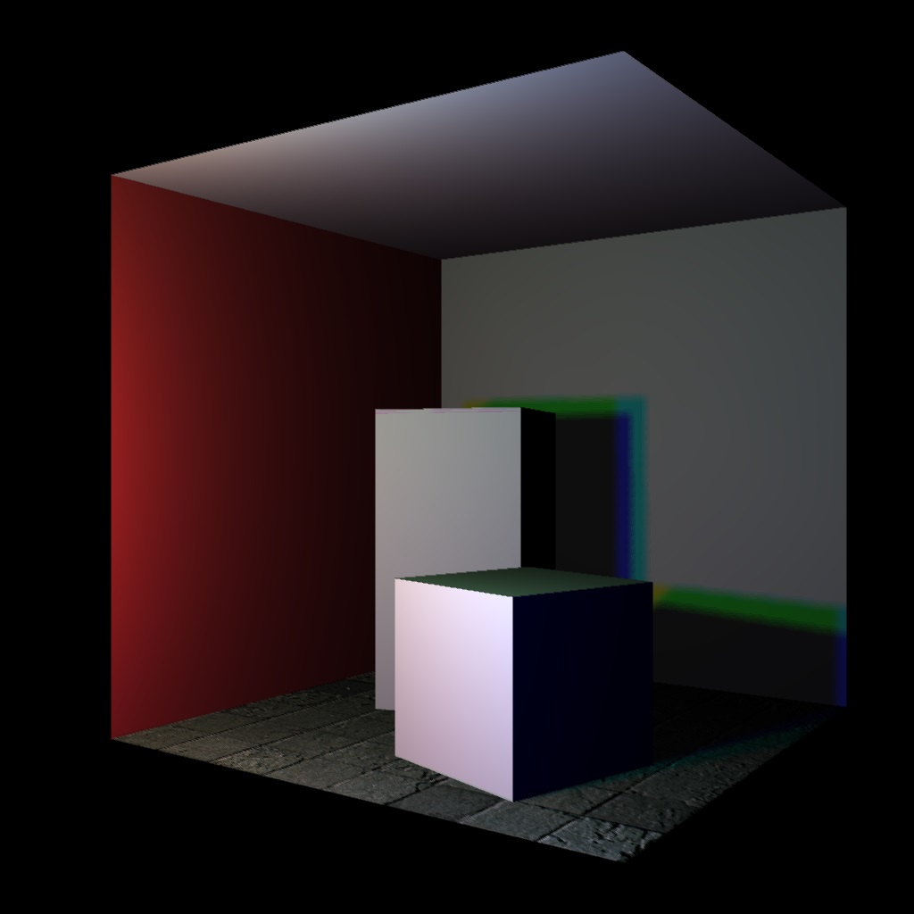

## Computer Graphics Report
Nick Pearson (np) & Ben Allen (ba14800)

#### Requirements
- Open CV 2
- OpenMP

### 1. Raytracer
This is our final raytracer image. To compile and run use `make raytracer && ./build/raytracer`.

### 1.1 Extensions

#### Global illumination
TODO

#### FXAA
We make use of Fast Anti Aliasing to smooth sharp edges. With FXAA this is done in screen space to reduce computation time. Here is a before & after.

#### KD-Trees
TODO

#### Depth of field
TODO

#### OpenMP + Blue crystal
OpenMP is used to concurrently perform calculations. This was found to a significant speed boost. We are then able to run the raytracer on bluecrystal for optimum speeds.

#### Object Loader
Object files can be loaded into the scene, using the left and right hand coordinate systems. Material definitions and vertex positions, normals and textures can also be loaded.
 This can be seen from the rabbit that is loaded in.

 ### 2. Rasterizer
 This is our final rasterizer image. To compile and run use `make rasterizer && ./build/raytracer`.

 

### 2.1 Extensions
#### Shadows
Description needed

#### Texture mapping
TODO

#### Normal Mapping
TODO

#### Clipping
In-progress

#### Object Loader
Similar to the raytracer, object files can be loaded into the scene, using the left and right hand coordinate systems. Material definitions and vertex positions, normals and textures can also be loaded.
 This can be seen from the rabbit that is loaded in.
